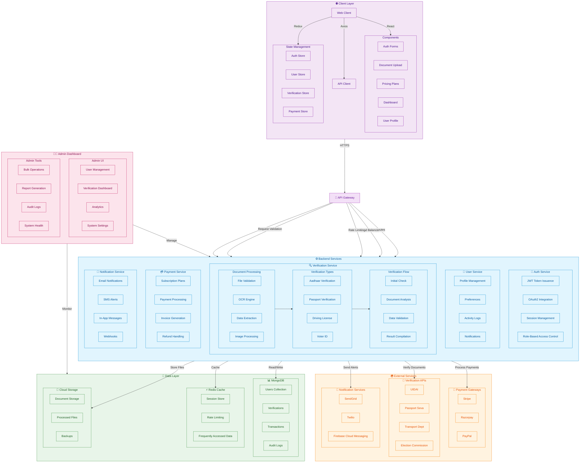

# VerifyMyKYC - Project Architecture

## System Architecture Overview



## Key Components Legend

| Component | Description |
|-----------|-------------|
| Client Application | React-based frontend with Redux state management |
| Backend Server | Node.js/Express microservices |
| Admin Dashboard | Administrative interface for system management |
| MongoDB | Primary NoSQL database |
| Redis | In-memory data store for caching |
| Cloud Storage | For document and file storage |
| Verification Services | Document processing and validation |
| External APIs | Third-party integrations |
| Auth Service | Authentication and authorization |

## Directory Structure

```
VerifyMyKyc/
├── admin/                  # Admin panel frontend
│   ├── public/
│   └── src/
│       ├── assets/
│       ├── components/
│       └── pages/
│
├── backend/               # Node.js backend
│   ├── src/
│   │   ├── common/       # Shared utilities
│   │   ├── config/       # Configuration
│   │   └── modules/      # Feature modules
│   │       ├── auth/     # Authentication
│   │       ├── blog/     # Blog management
│   │       ├── pricing/  # Pricing plans
│   │       └── verify/   # Verification services
│   └── .env              # Environment variables
│
└── client/               # Main frontend
    ├── public/
    └── src/
        ├── components/   # Reusable UI components
        ├── containers/   # Page components
        │   └── Home/     # Homepage components
        │       └── PricingSection.tsx
        ├── context/      # React context providers
        ├── types/        # TypeScript types
        └── utils/        # Utility functions
            ├── aadhaarServices.ts
            ├── passportServices.ts
            └── ...
```

## Core Components

### 1. Pricing Section (`PricingSection.tsx`)
- **Purpose**: Display and manage subscription plans with interactive features
- **Key Features**:
  - Dynamic plan cards with smooth animations
  - Billing period toggle (monthly/yearly/custom)
  - Responsive design for all device sizes
  - Interactive hover/focus states with visual feedback
  - Scroll-snap functionality for plan cards
  - Accessibility support (keyboard navigation, ARIA labels)

- **State Management**:
  ```typescript
  const [hoveredCard, setHoveredCard] = useState<number | null>(null);
  const [focusedCard, setFocusedCard] = useState<number | null>(0);
  const [billingPeriod, setBillingPeriod] = useState<'monthly' | 'yearly' | 'custom'>('monthly');
  const { homepagePlans, homepageLoading, homepageError, getHomepagePlansByPeriod } = usePricingContext();
  ```

### 2. Verification Services

#### Aadhaar Service (`aadhaarServices.ts`)
- **Features**:
  - OCR v2 for front/back image processing
  - Multi-step form handling
  - Real-time validation
  - Secure file uploads

- **Service Configuration**:
  ```typescript
  export const aadhaarServices: AadhaarServiceMeta[] = [
    {
      key: "ocr-v2",
      name: "Aadhaar OCR (File Upload)",
      description: "Extract data from Aadhaar image (file upload)",
      apiEndpoint: "/api/aadhaar/ocr-v2",
      formFields: [
        { name: "file_front", label: "Aadhaar Front Image", 
          type: "file", required: true },
        { name: "file_back", label: "Aadhaar Back Image", 
          type: "file", required: false },
        { name: "consent", label: "Consent", 
          type: "text", required: true },
      ],
      icon: Upload,
    }
  ];
  ```

## UI/UX Architecture

### 1. Design System

#### Color Palette
```scss
// Primary Colors
$primary: #2563eb;      // Main brand color
$primary-dark: #1d4ed8; // Hover state
$primary-light: #3b82f6; // Active state

// Secondary Colors
$secondary: #7c3aed;
$accent: #ec4899;

// Neutral Colors
$gray-50: #f9fafb;
$gray-100: #f3f4f6;
$gray-900: #111827;

// Status Colors
$success: #10b981;
$warning: #f59e0b;
$error: #ef4444;
$info: #3b82f6;
```

#### Typography
- **Primary Font**: 'Inter', sans-serif
- **Font Weights**: 400 (Regular), 500 (Medium), 600 (SemiBold), 700 (Bold)
- **Type Scale**:
  - H1: 3rem (48px)
  - H2: 2.25rem (36px)
  - H3: 1.5rem (24px)
  - Body: 1rem (16px)
  - Small: 0.875rem (14px)

### 2. Component Library

#### Button Component
```tsx
interface ButtonProps {
  variant?: 'primary' | 'secondary' | 'outline' | 'ghost' | 'link';
  size?: 'sm' | 'md' | 'lg';
  isLoading?: boolean;
  disabled?: boolean;
  fullWidth?: boolean;
  leftIcon?: React.ReactNode;
  rightIcon?: React.ReactNode;
  children: React.ReactNode;
  onClick?: () => void;
}
```

## Deployment

### Frontend
- Built with Vite
- Deployed on Vercel/Netlify
- Environment-based configuration

### Backend
- Node.js with Express
- MongoDB Atlas
- Containerized with Docker
- CI/CD with GitHub Actions

## Development Setup

1. Clone the repository
2. Install dependencies:
   ```bash
   cd client && npm install
   cd ../admin && npm install
   cd ../backend && npm install
   ```
3. Set up environment variables
4. Start development servers:
   ```bash
   # Backend
   cd backend && npm run dev
   
   # Client
   cd ../client && npm run dev
   
   # Admin
   cd ../admin && npm run dev
   ```

## Testing

```bash
# Run all tests
npm test

# Run specific test suite
npm test -- <test-file>
```

## Contributing
1. Create a feature branch
2. Make your changes
3. Write tests
4. Submit a pull request

## License
[Your License Here]
